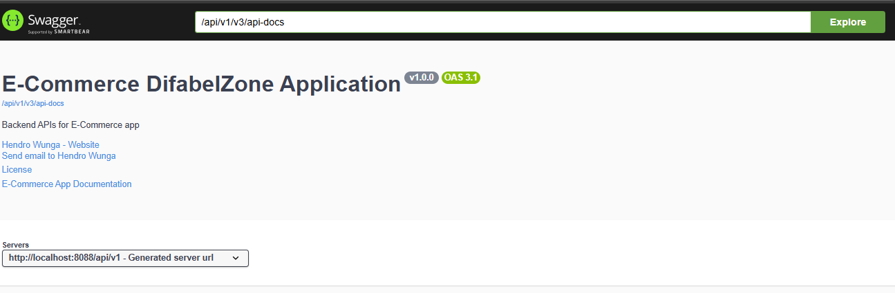
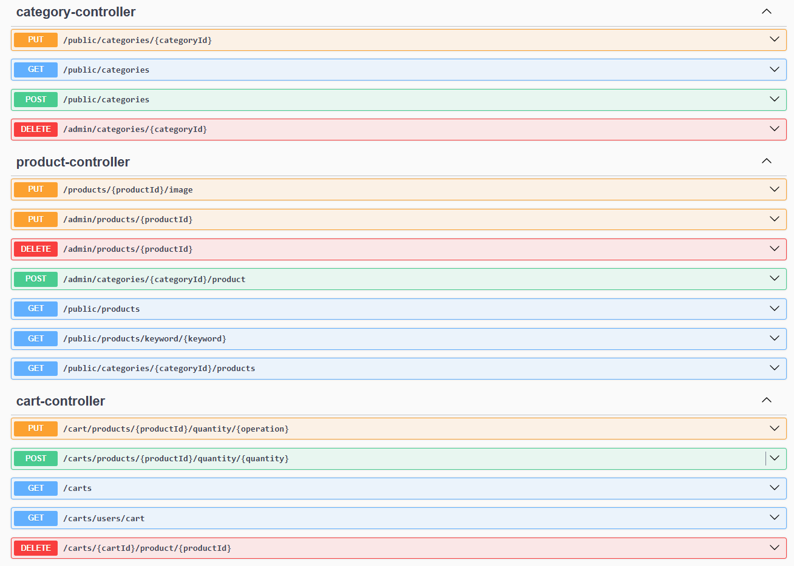
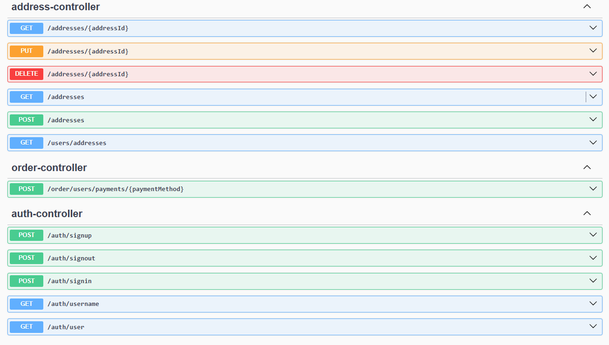

<h1 align="center">DifabelZone Backend 🚀</h1>  

  
  DifabelZone adalah platform yang dirancang untuk memberikan informasi dan layanan bagi penyandang disabilitas. Proyek ini bertujuan untuk meningkatkan aksesibilitas dan inklusi bagi semua individu. 🌍  

  

<h2>Daftar Isi 📚</h2>
<ul>  
  <li><input type="checkbox" disabled> <a href="#fitur">Fitur</a></li>  
  <li><input type="checkbox" disabled> <a href="#prasyarat">Prasyarat</a></li>  
  <li><input type="checkbox" disabled> <a href="#instalasi">Instalasi</a></li>  
  <li><input type="checkbox" disabled> <a href="#penggunaan">Penggunaan</a></li>  
  <li><input type="checkbox" disabled> <a href="#api-endpoints">API Endpoints</a></li>  
  <li><input type="checkbox" disabled> <a href="#swagger">Swagger</a></li>  
  <li><input type="checkbox" disabled> <a href="#konfigurasi">Konfigurasi</a></li>  
</ul>  

<h2>Fitur 🎯</h2>
<h3>Fitur Admin 👨‍💼</h3>

<ul>  
    <li><strong>Login</strong>: Akses aman ke panel admin untuk mengelola semua aspek platform.</li>  
    <li><strong>Manajemen Pengguna</strong>: Melihat, menambah, mengedit, dan menghapus pengguna yang terdaftar.</li>  
    <li><strong>Manajemen Alamat</strong>: Mengelola alamat pengguna untuk pengiriman dan penagihan.</li>  
    <li><strong>Manajemen Kategori</strong>: Menambah, mengedit, dan menghapus kategori produk untuk pengorganisasian yang lebih baik.</li>  
    <li><strong>Manajemen Produk</strong>: Menambah, mengedit, dan menghapus produk dari katalog.</li>  
    <li><strong>Pengaturan Harga & Diskon</strong>: Mengelola harga produk dan menerapkan diskon sesuai kebutuhan.</li>  
    <li><strong>Manajemen Pesanan</strong>: Melihat dan mengelola semua pesanan yang dibuat oleh pengguna.</li>  
</ul>  

<h3>Fitur Pengguna 👤</h3>

<ul>  
    <li><strong>Registrasi & Login</strong>: Proses pendaftaran dan login yang aman untuk pengguna baru dan yang sudah ada.</li>  
    <li><strong>Pengambilan Kategori dan Produk</strong>: Mengambil daftar kategori dan produk berdasarkan kategori yang dipilih.</li>  
    <li><strong>Manajemen Keranjang Belanja</strong>: Menambah dan menghapus produk dari keranjang belanja dengan mudah.</li>  
    <li><strong>Pengelolaan Alamat</strong>: Menambah, mengedit, dan menghapus alamat untuk pengiriman.</li>  
    <li><strong>Pengelolaan Kuantitas Produk</strong>: Mengatur jumlah produk dalam keranjang sebelum melakukan pemesanan.</li>  
    <li><strong>Pemesanan Produk</strong>: Memproses pemesanan produk dan mendapatkan status pesanan secara real-time.</li>  
</ul>  

<h2>Prasyarat ⚙️</h2>

Sebelum memulai, pastikan Anda memiliki hal-hal berikut:
  

<ul>  
    <li>Java JDK 23 atau lebih baru ☕</li>  
    <li>Maven 3.6 atau lebih baru 📦</li>  
    <li>IDE (IntelliJ IDEA, Eclipse, atau lainnya) 💻</li>  
    <li>Database (PostgreSQL) 🗄️</li>  
</ul>  

<h2>Instalasi 🛠️</h2>

Langkah-langkah untuk menginstal dan menjalankan proyek ini:
  

<ol>  
    <li>Clone repositori ini:   
        <pre><code>git clone https://github.com/hendrowunga/DifabelZone.git</code></pre>  
    </li>  
    <li>Pindahkan ke direktori proyek:  
        <pre><code>cd DifabelZone/backend</code></pre>  
    </li>  
    <li>Install dependensi:  
        <pre><code>mvn install</code></pre>  
    </li>  
    <li>Jalankan aplikasi:  
        <pre><code>mvn spring-boot:run</code></pre>  
    </li>  
</ol>  

<h2>Penggunaan 🌐</h2>

Aplikasi DifabelZone dapat diakses melalui URL: <a href="http://localhost:8088">http://localhost:8088</a>.
  

<h2>API Endpoints 📡</h2>

API Endpoints dapat diakses melalui URL: <a href="http://localhost:8088/api/v1/">http://localhost:8088/api/v1/</a>
  

<h3>Category Controller</h3>
<table>  
    <tr>  
        <th>Metode</th>  
        <th>Endpoint</th>  
        <th>Deskripsi</th>  
    </tr>  
    <tr>  
        <td>PUT</td>  
        <td>/public/categories/{categoryId}</td>  
        <td>Memperbarui kategori berdasarkan ID</td>  
    </tr>  
    <tr>  
        <td>GET</td>  
        <td>/public/categories</td>  
        <td>Mengambil semua kategori</td>  
    </tr>  
    <tr>  
        <td>POST</td>  
        <td>/public/categories</td>  
        <td>Menambahkan kategori baru</td>  
    </tr>  
    <tr>  
        <td>DELETE</td>  
        <td>/admin/categories/{categoryId}</td>  
        <td>Menghapus kategori berdasarkan ID</td>  
    </tr>  
</table>  

<h3>Product Controller</h3>
<table>  
    <tr>  
        <th>Metode</th>  
        <th>Endpoint</th>  
        <th>Deskripsi</th>  
    </tr>  
    <tr>  
        <td>PUT</td>  
        <td>/products/{productId}/image</td>  
        <td>Memperbarui gambar produk berdasarkan ID</td>  
    </tr>  
    <tr>  
        <td>PUT</td>  
        <td>/admin/products/{productId}</td>  
        <td>Memperbarui produk berdasarkan ID</td>  
    </tr>  
    <tr>  
        <td>DELETE</td>  
        <td>/admin/products/{productId}</td>  
        <td>Menghapus produk berdasarkan ID</td>  
    </tr>  
    <tr>  
        <td>POST</td>  
        <td>/admin/categories/{categoryId}/product</td>  
        <td>Menambahkan produk ke kategori</td>  
    </tr>  
    <tr>  
        <td>GET</td>  
        <td>/public/products</td>  
        <td>Mengambil semua produk</td>  
    </tr>  
    <tr>  
        <td>GET</td>  
        <td>/public/products/keyword/{keyword}</td>  
        <td>Mengambil produk berdasarkan kata kunci</td>  
    </tr>  
    <tr>  
        <td>GET</td>  
        <td>/public/categories/{categoryId}/products</td>  
        <td>Mengambil produk berdasarkan kategori ID</td>  
    </tr>  
</table>  

<h3>Cart Controller</h3>
<table>  
    <tr>  
        <th>Metode</th>  
        <th>Endpoint</th>  
        <th>Deskripsi</th>  
    </tr>  
    <tr>  
        <td>PUT</td>  
        <td>/cart/products/{productId}/quantity/{operation}</td>  
        <td>Mengubah kuantitas produk dalam keranjang</td>  
    </tr>  
    <tr>  
        <td>POST</td>  
        <td>/carts/products/{productId}/quantity/{quantity}</td>  
        <td>Menambahkan produk ke keranjang dengan kuantitas</td>  
    </tr>  
    <tr>  
        <td>GET</td>  
        <td>/carts</td>  
        <td>Mengambil semua keranjang</td>  
    </tr>  
    <tr>  
        <td>GET</td>  
        <td>/carts/users/cart</td>  
        <td>Mengambil keranjang pengguna</td>  
    </tr>  
    <tr>  
        <td>DELETE</td>  
        <td>/carts/{cartId}/productId</td>  
        <td>Menghapus produk dari keranjang</td>  
    </tr>  
</table>  

<h3>Address Controller</h3>
<table>  
    <tr>  
        <th>Metode</th>  
        <th>Endpoint</th>  
        <th>Deskripsi</th>  
    </tr>  
    <tr>  
        <td>GET</td>  
        <td>/addresses/{addressId}</td>  
        <td>Mengambil alamat berdasarkan ID</td>  
    </tr>  
    <tr>  
        <td>PUT</td>  
        <td>/addresses/{addressId}</td>  
        <td>Memperbarui alamat berdasarkan ID</td>  
    </tr>  
    <tr>  
        <td>DELETE</td>  
        <td>/addresses/{addressId}</td>  
        <td>Menghapus alamat berdasarkan ID</td>  
    </tr>  
    <tr>  
        <td>GET</td>  
        <td>/addresses</td>  
        <td>Mengambil semua alamat</td>  
    </tr>  
    <tr>  
        <td>POST</td>  
        <td>/addresses</td>  
        <td>Menambahkan alamat baru</td>  
    </tr>  
    <tr>  
        <td>GET</td>  
        <td>/users/addresses</td>  
        <td>Mengambil alamat pengguna</td>  
    </tr>  
</table>  

<h3>Order Controller</h3>
<table>  
    <tr>  
        <th>Metode</th>  
        <th>Endpoint</th>  
        <th>Deskripsi</th>  
    </tr>  
    <tr>  
        <td>POST</td>  
        <td>/order/users/payments/{paymentMethod}</td>  
        <td>Memproses pembayaran untuk pesanan</td>  
    </tr>  
</table>  

<h3>Auth Controller</h3>
<table>  
    <tr>  
        <th>Metode</th>  
        <th>Endpoint</th>  
        <th>Deskripsi</th>  
    </tr>  
    <tr>  
        <td>POST</td>  
        <td>/auth/signup</td>  
        <td>Mendaftar pengguna baru</td>  
    </tr>  
    <tr>  
        <td>POST</td>  
        <td>/auth/signout</td>  
        <td>Mengeluarkan pengguna</td>  
    </tr>  
    <tr>  
        <td>POST</td>  
        <td>/auth/signin</td>  
        <td>Masuk sebagai pengguna</td>  
    </tr>  
    <tr>  
        <td>GET</td>  
        <td>/auth/username</td>  
        <td>Mengambil nama pengguna</td>  
    </tr>  
    <tr>  
        <td>GET</td>  
        <td>/auth/user</td>  
        <td>Mengambil informasi pengguna</td>  
    </tr>  
</table>  

<h2>Swagger 📚</h2>

Swagger dapat diakses melalui URL: <a href="http://localhost:8088/api/v1/swagger-ui/index.html">http://localhost:8088/api/v1/swagger-ui/index.html</a>
  

  
  
  

<h2>Konfigurasi ⚙️</h2>

<h3>application-dev.yml</h3>
<pre><code>spring:  
  datasource:  
    url: jdbc:postgresql://localhost:5432/YOUR_DATABASE  
    username: YOUR_USERNAME  
    password: YOUR_PASSWORD  
    driver-class-name: org.postgresql.Driver  
  jpa:  
    hibernate:  
      ddl-auto: update  
    show-sql: false  
    properties:  
      hibernate:  
        format_sql: true  
    database: postgresql  
    database-platform: org.hibernate.dialect.PostgreSQLDialect  
  
  application:  
    security:  
      jwt:  
        secret-key: YOUR_SECRET_KEY  
        expiration: YOUR_EXPIRATION_TIME  
        jwtCookieName: YOUR_JWT_COOKIE_NAME  
    file:  
      images-output-path: YOUR_IMAGES_OUTPUT_PATH      
      images-base-url: YOUR_IMAGES_BASE_URL  
</code></pre>  

<h3>application.yml</h3>
<pre><code>spring:  
  profiles:  
    active: dev  
springdoc:  
  default-produces-media-type: application/json  
server:  
  servlet:  
    context-path: /api/v1/  
</code></pre>  
